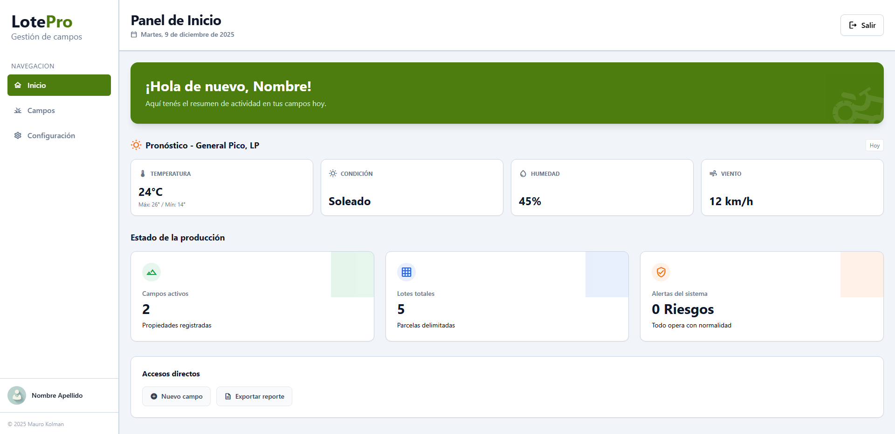
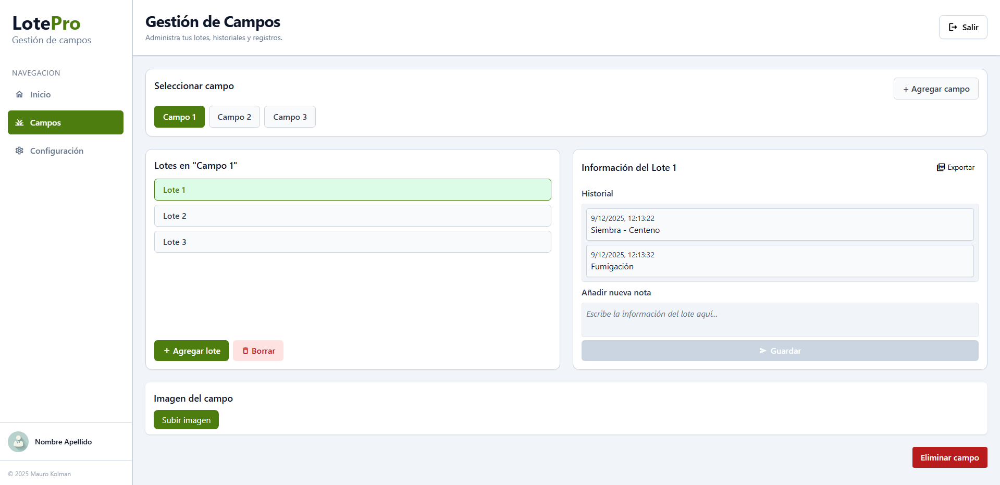
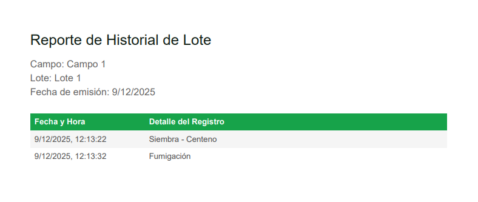

# 🌾 Campo-app

> **Una solución digital para la gestión eficiente del campo.**


## 📖 Descripción

**Campo-app** es una aplicación diseñada para facilitar el monitoreo de cultivos. Nuestro objetivo es brindar a los productores herramientas sencillas para tomar decisiones basadas en datos.

### 🚀 Funcionalidades Principales

* ✅ **Gestión de Lotes:** Visualiza y administra el estado de tus parcelas.
* ✅ **Registro de Actividades:** Lleva un control de siembra, cosecha y tratamientos.
* ✅ **Reportes:** Exporta datos a PDF/Excel.
* *Agrega aquí más funcionalidades específicas de tu app.*

---

## 🛠️ Tecnologías Utilizadas

Este proyecto está construido con las siguientes herramientas:

* **Frontend:** React
* **Backend:** Node.js, Firebase
* **Base de Datos:** Firestore

---

## 📸 Capturas de Pantalla

| Inicio | Gestión de Lotes | Reportes |
|:---:|:---:|:---:|
|  |  |  |

---

## 🔧 Instalación y Configuración

Sigue estos pasos para correr el proyecto localmente:

### Prerrequisitos
* Git
* Node.js

### Pasos

1.  **Clonar el repositorio:**
    ```bash
    git clone https://github.com/RedBoth/Campo-app.git
    cd Campo-app
    ```

2.  **Instalar dependencias:**
    ```bash
    npm install
    ```

3.  **Configurar variables de entorno:**
    Crea un archivo `.env` basado en el `.env.example` y configura tus claves (API Keys, DB, etc.).
    ```bash
    VITE_FIREBASE_API_KEY=""
    VITE_FIREBASE_AUTH_DOMAIN=""
    VITE_FIREBASE_PROJECT_ID=""
    VITE_FIREBASE_STORAGE_BUCKET=""
    VITE_FIREBASE_MESSAGING_SENDER_ID=""
    VITE_FIREBASE_APP_ID=""
    ```

4.  **Ejecutar la aplicación:**
    ```bash
    npm run dev
    ```

---

## 🤝 Contribución

¡Las contribuciones son bienvenidas! Si deseas mejorar Campo-app:

1.  Haz un Fork del proyecto.
2.  Crea una rama para tu funcionalidad (`git checkout -b feature/nueva-funcionalidad`).
3.  Haz Commit de tus cambios (`git commit -m 'Agrega nueva funcionalidad'`).
4.  Haz Push a la rama (`git push origin feature/nueva-funcionalidad`).
5.  Abre un Pull Request.

---

## 📄 Licencia

Este proyecto está bajo la Licencia MIT - mira el archivo [LICENSE.md](LICENSE) para más detalles.

---

⌨️ con ❤️ por [RedBoth](https://github.com/RedBoth)